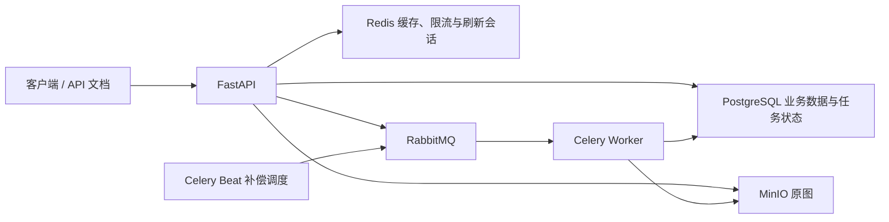
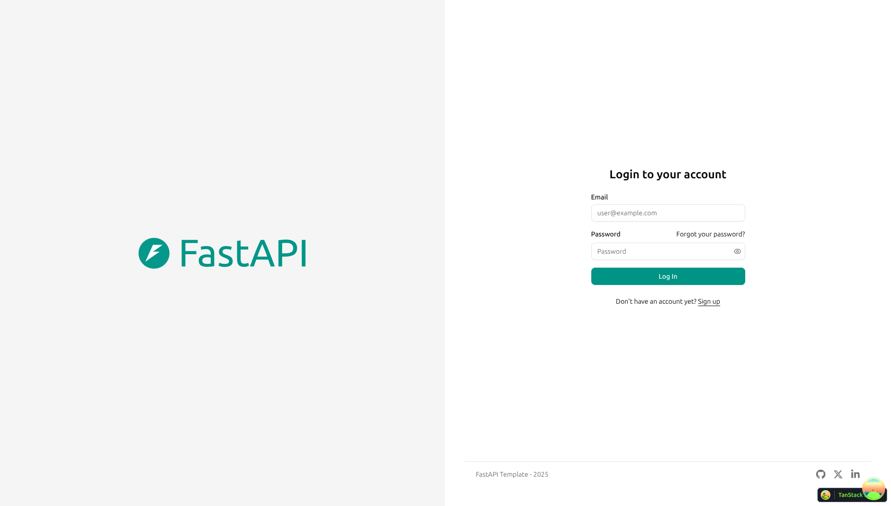
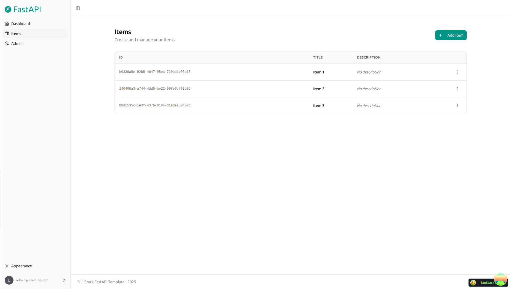
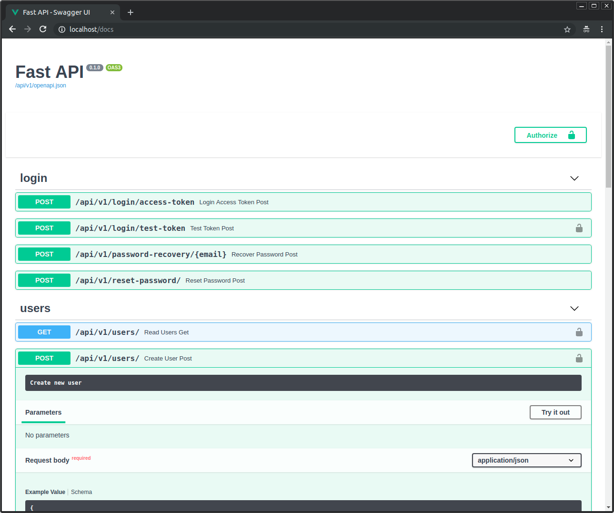

# CampusTaste：校园食堂菜品评价与排行榜系统

本项目基于 Full Stack FastAPI Template，按阶段开发，用于 Python 后端开发学习与实习求职。阶段 0～6 已完成本地后端验证，校园菜品审核、评价与加权排行榜、Redis 缓存和限流、内容治理、图片异步处理及工程化已实现；GitHub Actions 尚未在云端运行。模板来源、提交号与能力归属见[上游说明](docs/upstream.md)。

## 业务场景与核心功能

围绕学校、食堂、档口和菜品组织评价，支持菜品提交与审核、评分与评价编辑、软删除与恢复，以及学校和食堂范围的加权排行榜。点赞、举报、评价隐藏与审核日志构成内容治理流程；评价图片通过后台任务生成缩略图。

## 模板能力与项目扩展

| 来源 | 能力 |
| --- | --- |
| Full Stack FastAPI Template 原有能力 | 用户注册与登录、密码哈希、JWT 基础认证、用户和 Item CRUD、邮件找回密码、React 界面、SQLModel/Alembic 基础结构、pytest 与 CI/部署工作流骨架 |
| CampusTaste 在模板上开发的业务与工程化扩展 | 校园目录与菜品审核、评价及评分聚合、加权榜单、Redis 缓存与 Lua 限流、刷新令牌轮换与撤销、角色权限与内容治理、MinIO 图片存储、Celery 异步处理与补偿、后端演示栈、业务测试和压测脚本 |

详细来源与采用的上游提交见[上游说明](docs/upstream.md)。模板 React 界面尚未扩展为校园业务界面；下方截图均为模板示例。当前展示重点是 Python 后端，未实现 AI Agent 业务模块。

## 系统架构



后端使用 Python 3.14、FastAPI、SQLModel/SQLAlchemy、Pydantic 和 Alembic；异步任务使用 Celery + RabbitMQ，图片处理使用 Pillow，文件存储使用 MinIO。Docker Compose 编排本地依赖、迁移、API、Worker 和 Beat。前端保留模板的 React、TypeScript 与 Vite。

### PostgreSQL 并发控制与事务

评价写入使用 `SELECT ... FOR UPDATE` 锁定菜品；修改、删除与恢复评价时按菜品、评价的顺序获取行锁。评价记录和菜品的 `rating_sum`、`rating_count` 在同一事务提交，数据库唯一约束限制同一用户对同一菜品重复评价。审核隐藏等治理操作同步维护评分聚合，另提供聚合重建工具。实现见[评价服务](backend/app/services/reviews.py)、[内容治理](backend/app/services/governance.py)和[评分重建](backend/app/services/rating_stats.py)。

### Redis 缓存与加权排行榜

菜品详情与榜单采用 Cache Aside，包含空值缓存、TTL 抖动、`SET NX EX` 重建锁与 Lua 校验令牌后释放锁。缓存故障时回退数据库；写事务提交后删除详情缓存并递增学校榜单版本。缓存失效仍有旧查询回填窗口，当前设计不保证强一致。

排行榜从 PostgreSQL 读取评分聚合，在 Python 中计算加权分数并排序，由 Redis 缓存 JSON 结果。权重结合菜品评价人数、平均分、学校整体均分和先验权重；这不是 Redis ZSET 排行榜。实现见[缓存服务](backend/app/services/cache.py)和[榜单接口](backend/app/api/routes/rankings.py)。

### Celery + RabbitMQ 图片异步任务

图片原图存入 MinIO，数据库记录图片与处理任务状态，RabbitMQ 传递任务 ID。Worker 使用 Pillow 生成 WebP 缩略图，通过任务行锁、状态检查和固定对象 key 限制重复执行影响；失败任务受尝试次数约束。Beat 每 30 秒调度补偿扫描，处理待派发或超时任务。数据库与对象存储没有跨系统原子事务，也不保证消息仅消费一次。实现见[任务处理](backend/app/tasks.py)与[Worker 配置](backend/app/worker.py)。

### RBAC 与认证

在模板认证上扩展普通用户、审核员和管理员角色，通过 FastAPI 依赖检查管理与审核权限，并在业务服务校验资源归属。Redis 保存刷新会话，支持 Refresh Token 轮换与撤销；退出后已经签发的 Access Token 仍以过期时间为边界。实现见[权限依赖](backend/app/api/deps.py)与[刷新会话](backend/app/services/refresh_tokens.py)。

## Docker Compose 本地启动

需要 WSL/Linux、Docker Engine 和 Docker Compose。首次配置时复制示例；已有 `.env` 时保留原文件：

```bash
# 仅在 .env 不存在时复制
if [ ! -f .env ]; then cp .env.example .env; fi
```

编辑 `.env`，替换示例密钥、管理员密码、PostgreSQL、RabbitMQ 和 MinIO 凭据，并保持连接 URL 与对应密码一致。真实 `.env` 不提交。然后在项目根目录执行：

```bash
sudo bash scripts/start-campus.sh
```

后端接口文档为 `http://localhost:8000/docs`，就绪检查为 `http://localhost:8000/api/v1/utils/ready/`。该启动栈不构建模板前端，迁移与初始化完成后启动 API、Worker 和 Beat；服务端口绑定本机。WSL 网络与代理配置见[阶段 6](docs/stage-6.md)，启动排障见[架构与运维](docs/operations.md)。

## 测试方法与已有结果

在本地依赖启动、`.env` 正确配置并安装 uv 后，从项目根目录执行：

```bash
uv sync --frozen --package app
cd backend
uv run --frozen --package app python scripts/test-stage5.py
```

脚本虽沿用阶段 5 名称，但运行完整 `backend/tests/`，使用独立 `campustaste_test` 数据库和 Redis DB 15，执行迁移、pytest、90% 覆盖率门槛及 Alembic 模型漂移检查。测试会清理测试数据，请为其保留独立测试库和 Redis DB。静态检查命令与真实依赖配置见[后端工作流](.github/workflows/test-backend.yml)。

以下为已有本地验收记录，整理 README 时未重新执行这些测试：

| 范围 | 已有记录 | 日期与来源 |
| --- | --- | --- |
| 完整后端测试 | 98 项通过，语句覆盖率 90%，Alembic 无模型漂移 | 2026-10-04，[阶段 6](docs/stage-6.md) |
| 本机只读 HTTP 压测 | 10 用户：32.85 RPS、P95 15 ms；30 用户：96.72 RPS、P95 17 ms；两轮均无失败请求 | 2026-10-04，[负载条件与结果](docs/performance.md) |
| 独立缓存与限流招聘样例 | 23 项通过，含分支总体覆盖率 98%；使用 Fake Redis 与合成数据 | 2026-10-07，[样例说明](recruitment_sample/README.md) |

压测仅覆盖菜品详情、榜单和评价列表，依赖共享本机资源且没有缓存开关对照，不代表写入容量、生产容量上限或性能提升幅度。GitHub Actions 尚未在云端运行，模板前端尚未验收，未进行公网部署。

## 项目导航与已知边界

- [演示与接口](docs/demo.md)、[求职与面试索引](docs/interview.md)、[路线图与验收状态](docs/roadmap.md)。
- [架构取舍与限制](docs/operations.md)：缓存一致性、图片任务、令牌撤销及运维边界。
- `backend/app/` 包含业务代码和 Alembic 迁移；`backend/tests/` 为后端测试，`backend/loadtests/` 为压测脚本。
- `frontend/`、`packages/react-email/` 保留模板前端与邮件模板；`recruitment_sample/` 为独立缓存与限流样例。
- `.github/workflows/` 保留模板及项目工作流；部分模板流程仍使用 `master` 或依赖额外部署配置，不代表已完成适配或云端验收。

## 模板技术栈与功能

- ⚡ [FastAPI](https://fastapi.tiangolo.com)：Python 后端 API。
  - [SQLModel](https://sqlmodel.tiangolo.com)：SQL 数据库交互与 ORM。
  - [Pydantic](https://docs.pydantic.dev)：数据校验与配置管理。
  - [PostgreSQL](https://www.postgresql.org)：关系型数据库。
- 🚀 [React](https://react.dev)：前端界面。
  - 构建后由 FastAPI 提供，与 API 使用同一域名。
  - 使用 TypeScript、Hooks 和 [Vite](https://vitejs.dev)。
  - 使用 [Tailwind CSS](https://tailwindcss.com) 和 [shadcn/ui](https://ui.shadcn.com) 构建组件。
  - 自动生成 API 客户端，支持深色模式。
  - 使用 [Playwright](https://playwright.dev) 进行端到端测试。
- ☁️ [FastAPI Cloud](https://fastapicloud.com)：模板提供的云部署方案。
- 🐋 [Docker Compose](https://www.docker.com)：本地依赖及自托管部署；[Traefik](https://traefik.io) 提供反向代理和自动 HTTPS。
- 🔒 密码哈希、JWT 认证及邮件找回密码。
- ✉️ [React Email](https://react.email)：邮件模板；[Mailpit](https://mailpit.axllent.org)：本地邮件测试。
- ✅ [pytest](https://pytest.org)：后端测试；GitHub Actions：持续集成与部署工作流。

这些能力来自上游模板。CampusTaste 的完整目标技术栈和阶段范围见[需求](docs/requirements.md)与[路线图](docs/roadmap.md)。

## 模板界面示例

### 登录页



### 管理员面板


### Item 示例管理



### 深色模式


### React Email 邮件模板


### Mailpit 本地邮件测试


### 交互式 API 文档



## 使用与开发

上游仓库的 **Use this template** 按钮可以创建模板仓库。本工作区已引入模板，无需再次生成。

- [阶段 0 启动、验收与面试问答](docs/stage-0.md)
- [后端开发](backend/README.md)
- [前端开发](frontend/README.md)
- [通用开发指南](development.md)：本地 FastAPI/Vite、Compose 与环境配置。
- [FastAPI Cloud 部署参考](deployment.md)
- [Docker Compose 部署参考](deployment-docker-compose.md)
- [上游发布记录](release-notes.md)

部署文档仅供参考；当前未进行公网部署。

## 许可证

上游 Full Stack FastAPI Template 使用 MIT 许可证。完整条款及原作者署名保留在 [LICENSE](LICENSE)。
