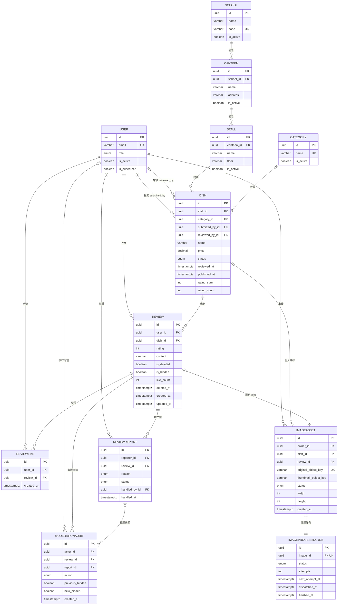

# 阶段 5 ER 图

```mermaid
erDiagram
    USER ||--o{ DISH : "提交 submitted_by"
    USER o|--o{ DISH : "审核 reviewed_by"
    SCHOOL ||--o{ CANTEEN : "包含"
    CANTEEN ||--o{ STALL : "包含"
    STALL ||--o{ DISH : "提供"
    CATEGORY o|--o{ DISH : "分类"
    USER ||--o{ REVIEW : "发表"
    DISH ||--o{ REVIEW : "收到"
    USER ||--o{ REVIEWLIKE : "点赞"
    REVIEW ||--o{ REVIEWLIKE : "获得"
    USER ||--o{ REVIEWREPORT : "举报"
    REVIEW ||--o{ REVIEWREPORT : "被举报"
    USER o|--o{ MODERATIONAUDIT : "执行治理"
    REVIEW ||--o{ MODERATIONAUDIT : "审计目标"
    REVIEWREPORT o|--o{ MODERATIONAUDIT : "处理来源"
    USER ||--o{ IMAGEASSET : "上传"
    DISH o|--o{ IMAGEASSET : "图片目标"
    REVIEW o|--o{ IMAGEASSET : "图片目标"
    IMAGEASSET ||--|| IMAGEPROCESSINGJOB : "处理任务"

    USER {
        uuid id PK
        varchar email UK
        enum role
        boolean is_active
        boolean is_superuser
    }
    SCHOOL {
        uuid id PK
        varchar name
        varchar code UK
        boolean is_active
    }
    CANTEEN {
        uuid id PK
        uuid school_id FK
        varchar name
        varchar address
        boolean is_active
    }
    STALL {
        uuid id PK
        uuid canteen_id FK
        varchar name
        varchar floor
        boolean is_active
    }
    CATEGORY {
        uuid id PK
        varchar name UK
        boolean is_active
    }
    DISH {
        uuid id PK
        uuid stall_id FK
        uuid category_id FK
        uuid submitted_by_id FK
        uuid reviewed_by_id FK
        varchar name
        decimal price
        enum status
        timestamptz reviewed_at
        timestamptz published_at
        int rating_sum
        int rating_count
    }
    REVIEW {
        uuid id PK
        uuid user_id FK
        uuid dish_id FK
        int rating
        varchar content
        boolean is_deleted
        boolean is_hidden
        int like_count
        timestamptz deleted_at
        timestamptz created_at
        timestamptz updated_at
    }
    REVIEWLIKE {
        uuid id PK
        uuid user_id FK
        uuid review_id FK
        timestamptz created_at
    }
    REVIEWREPORT {
        uuid id PK
        uuid reporter_id FK
        uuid review_id FK
        enum reason
        enum status
        uuid handled_by_id FK
        timestamptz handled_at
    }
    MODERATIONAUDIT {
        uuid id PK
        uuid actor_id FK
        uuid review_id FK
        uuid report_id FK
        enum action
        boolean previous_hidden
        boolean new_hidden
        timestamptz created_at
    }
    IMAGEASSET {
        uuid id PK
        uuid owner_id FK
        uuid dish_id FK
        uuid review_id FK
        varchar original_object_key UK
        varchar thumbnail_object_key
        enum status
        int width
        int height
        timestamptz created_at
    }
    IMAGEPROCESSINGJOB {
        uuid id PK
        uuid image_id FK,UK
        enum status
        int attempts
        timestamptz next_attempt_at
        timestamptz dispatched_at
        timestamptz finished_at
    }
```

主业务层级是“学校 → 食堂 → 档口 → 菜品 → 评价”。分类作为横向维度独立存在；用户通过不同外键表达菜品提交者、审核者、评价作者、点赞者、举报者、治理执行者和图片上传者。图片必须恰好关联菜品或评价之一，每张图片拥有一条持久化处理任务；MinIO 只保存对象内容，归属、可见性和处理状态由 PostgreSQL 保存。
