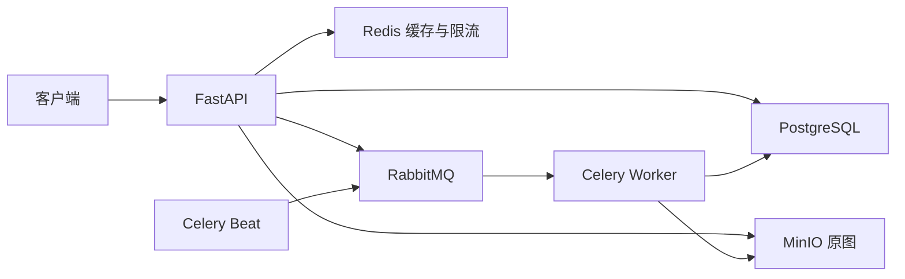

# 架构取舍、限制与排障

## 请求和任务路径



FastAPI 使用同步数据库与存储调用的接口在工作线程执行；PostgreSQL 保存业务数据、评分聚合和任务状态；Redis 为详情与榜单提供 Cache Aside、Lua 限流和刷新令牌状态。RabbitMQ 传递任务 ID，Worker 使用 Pillow 生成缩略图，Beat 每 30 秒安排补偿扫描。

评价沿用统一行锁顺序并在同一事务更新评价与评分；唯一约束最终防重。图片任务通过任务行锁、状态及尝试次数校验限制重复执行，并以固定缩略图 key 覆盖结果；不声称消息只消费一次。

## 已知边界

- PostgreSQL 和 MinIO 没有跨系统原子事务；数据库提交失败时尽力删除原图，删除失败仍可能产生孤立对象。
- Redis 删除缓存仍有旧查询回填窗口；TTL 约束详情缓存陈旧时间，榜单以学校版本隔离，并非强一致。
- Refresh Token 退出会撤销刷新会话，已签发 Access Token 不立即撤销，仍以过期时间为边界。
- 游标分页提供稳定排序，不提供跨请求快照。榜单当前在 Python 中计算排序，学校规模变大后需要重新评估。
- 上传业务限制读取字节数及像素数，不等同于入口代理限制整个 HTTP 上传体。
- 签名图片 URL 有效期 15 分钟；隐藏评价后已发出的链接不会立即失效。
- Worker 处理期间持有数据库行锁和连接，这是当前受限图片大小下的取舍，不适合任意长任务。
- 就绪检查证明依赖可连接，不证明迁移版本正确、存储凭据可写、Worker 消费正常。真实链路依赖专项集成测试。
- 模板前端主要展示原用户与 Item 功能，尚未实现 CampusTaste 专用校园界面。
- CI 尚未在 GitHub 运行；没有公网部署、可用性保证或压力容量承诺。

## 日志和排障

```bash
sudo docker compose -f compose.campustaste.yml ps
sudo docker compose -f compose.campustaste.yml logs --tail=50 backend worker beat migrate
curl -i http://localhost:8000/api/v1/utils/ready/
```

应用请求日志只记录方法、路由模板、状态码、耗时和请求 ID，不记录正文、查询串、Authorization。客户端可以提供字符受限的 `X-Request-ID`，否则服务端生成；这是定位标识，不是权限凭据。应用异常仅输出类型；排查时查看任务失败状态并检查配置，勿分享带密钥的配置输出。

| 现象 | 检查步骤 |
| --- | --- |
| 镜像拉取 TLS 超时 | 检查 Docker 守护进程代理；构建内安装再检查 HTTP_PROXY/HTTPS_PROXY 与代理端口 |
| API 就绪 503 | 查看 `checks` 中哪个依赖不可用，检查相应容器和连接设置 |
| API 未启动 | 检查 `migrate` 是否成功，数据库服务是否健康，8000 是否被占用 |
| 图片一直 pending | 检查 Worker、Beat 是否运行及队列名称；补偿最多需等待过期时间再扫描 |
| 图片 failed | 查失败查询接口；修复原图或配置后由有权限的人手动重试 |
| 缩略图请求 409 | 查询图片是否 ready，等待处理完成或处理失败 |
| 临时图片链接访问失败 | 检查有效期、公共 MinIO 地址以及浏览器能否访问该地址 |
| 测试连接开发库 | 使用独立测试脚本，不直接在默认 DATABASE_URL 下执行完整测试 |

只停止服务、保留数据：`sudo docker compose -f compose.campustaste.yml stop`。本地不要使用 `down -v`，它会删除数据卷。CI 的 `down -v` 只用于一次性 GitHub runner。
