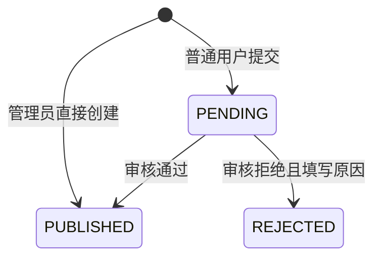

# 阶段 1：数据模型、基础权限与菜品审核

当前状态：已验证（2026-09-24）。代码、迁移、演示数据、权限测试和真实 HTTP 流程均已完成；未进入阶段 2。

## 实现范围

- 新增学校、食堂、档口、分类和菜品 SQLModel 模型。
- 新增 `USER`、`REVIEWER`、`ADMIN` 角色，保留模板 `is_superuser` 兼容字段。
- 管理员维护基础目录；公开接口只返回启用的目录资源。
- 普通用户提交菜品时由服务端绑定提交者，初始状态为待审核。
- 审核员和管理员可查看待审核队列，并通过或拒绝菜品。
- 管理员创建菜品时直接公开，并记录管理员为审核者。
- 普通用户只能修改本人待审核菜品，不能修改他人或已审核菜品。
- 公开查询只返回已发布菜品，待审核和已拒绝菜品不会通过公开详情泄露。
- 初始化脚本幂等创建一组中文演示数据。

未加入评价、评分统计、排行榜、Redis、举报、图片或异步任务，这些属于后续阶段。

## 状态转换



`PUBLISHED` 和 `REJECTED` 在阶段 1 是终态。拒绝后修改并重新提交需要明确产品语义，当前不提供，避免隐式绕过审核。

## 关键请求路径

普通用户提交菜品：

```text
POST /api/v1/dishes/
→ JWT 得到 CurrentUser
→ dishes.create_dish 校验启用的档口和分类
→ 服务端写 submitted_by_id 和 PENDING
→ 提交事务并返回 DishPublic
```

审核员审核：

```text
POST /api/v1/dishes/{id}/review
→ get_current_reviewer 检查 REVIEWER/ADMIN
→ 仅接受当前 PENDING 的记录
→ 校验目标状态和拒绝原因
→ 同一次提交写状态、审核人和 UTC 时间
```

## 关键文件

- `backend/app/models.py`：角色、学校、食堂、档口、分类、菜品及请求响应模型。
- `backend/app/api/routes/catalog.py`：基础目录公开查询和管理员维护接口。
- `backend/app/api/routes/dishes.py`：菜品公开查询、个人提交、修改与审核接口。
- `backend/app/services/dishes.py`：引用校验、创建规则和审核状态转换。
- `backend/app/api/deps.py`：管理员和审核员权限依赖。
- `backend/app/alembic/versions/c1a2b3d4e5f6_*.py`：阶段 1 数据库迁移。
- `backend/app/core/db.py`：幂等演示数据初始化。
- `backend/tests/api/routes/test_catalog_dishes.py`：权限、归属和状态转换测试。
- `docs/er-diagram.md`、`docs/data-dictionary.md`：ER 图与数据字典。

## 设计选择与取舍

- 使用枚举约束角色和审核状态，避免数据库出现任意字符串。
- 使用 `NUMERIC(10,2)` 保存价格，避免浮点误差。
- 基础目录采用 `is_active` 停用，而不是提供硬删除接口，避免破坏层级引用。
- 分类全局共享，减少每个学校重复维护相同分类；菜品可以暂时没有分类。
- 路由处理 HTTP 输入输出，状态转换放在 `services/dishes.py`，事务提交集中在服务函数，不为简单目录 CRUD 增加多余仓储层。
- 阶段 1 暂时保留 `is_superuser`，让模板管理员接口继续工作。角色升级只能通过管理员用户接口；注册和“修改自己”接口没有角色字段。
- 审核状态转换目前由应用服务保证，枚举、外键和非负金额由数据库保证。阶段 2 的并发评分会使用更强的行锁和事务设计。

## 接口概览

- `GET/POST /api/v1/schools`、`PATCH /api/v1/schools/{id}`。
- `GET/POST /api/v1/canteens`、`PATCH /api/v1/canteens/{id}`。
- `GET/POST /api/v1/stalls`、`PATCH /api/v1/stalls/{id}`。
- `GET/POST /api/v1/categories`、`PATCH /api/v1/categories/{id}`。
- `GET/POST /api/v1/dishes/`：公开列表与提交。
- `GET /api/v1/dishes/mine`：当前用户提交记录。
- `GET /api/v1/dishes/pending`：审核队列。
- `GET/PATCH /api/v1/dishes/{id}`：公开详情与受限修改。
- `POST /api/v1/dishes/{id}/review`：审核。

## 验证清单

- PostgreSQL 18.6 的开发库和独立测试库均迁移到 `c1a2b3d4e5f6`。
- 实际检查到 `school`、`canteen`、`stall`、`category`、`dish` 五张表，以及四个唯一约束和 `ck_dish_price_nonnegative`。
- 在临时 PostgreSQL 数据库执行 `upgrade head → downgrade fe56fa70289e → upgrade head`，往返迁移通过，临时数据库随后删除。
- 完整 pytest：67 项全部通过，2 个上游警告，耗时 6.72 秒。
- 语句覆盖率：90%，`coverage report --fail-under=90` 通过。
- Ruff、Ruff format、mypy、ty 全部通过。
- OpenAPI 已生成全部阶段 1 接口。
- 真实 Uvicorn HTTP 流程通过：管理员登录和创建角色、普通用户提交得到 `pending`、待审核详情公开访问返回 404、审核员查看队列并通过、公开详情返回 200、普通用户维护学校返回 403。

两项警告分别来自模板使用的 Starlette TestClient 兼容层，以及开发模式未构建前端目录；均未影响阶段 1 后端验收。HTTP 验收进程已停止，PostgreSQL 与 Mailpit 继续运行。

## 启动与验收步骤

在项目根目录启动依赖，当前 WSL 用户管理 Docker 时需要 `sudo`：

```bash
cd /home/david/CampusTaste
sudo docker compose up -d --wait db mailpit
cd backend
uv sync --locked
uv run --locked bash scripts/prestart.sh
uv run --locked fastapi dev --host 127.0.0.1
```

访问 <http://127.0.0.1:8000/docs>。可先使用根目录 `.env` 中的本地管理员登录，再按顺序调用学校、食堂、档口、分类、菜品提交和审核接口；不要复制或公开 `.env` 中的密码和密钥。

运行静态检查：

```bash
cd /home/david/CampusTaste/backend
uv run --locked ruff format app tests --check
uv run --locked ruff check app tests
uv run --locked mypy app
uv run --locked ty check app
```

完整测试必须使用独立 PostgreSQL 测试库，不能直接指向开发数据。可复制的测试库配置和创建步骤见 `docs/stage-0.md`；设置测试库 `DATABASE_URL` 后运行：

```bash
uv run --locked bash scripts/prestart.sh
uv run --locked bash scripts/test.sh "阶段 1 验收"
uv run --locked coverage report --fail-under=90
```

## 面试问题与回答要点

1. **为什么角色和 `is_superuser` 同时存在？** 角色是 CampusTaste 的业务权限模型；`is_superuser` 来自模板。阶段 1 采用兼容迁移，降低一次性改动风险，新管理员保持两者一致，后续可单独移除旧字段。
2. **数据库约束和接口校验如何分工？** 枚举、外键、唯一性、非空与金额范围放在数据库作为最终防线；权限、启用状态、拒绝原因和状态转换需要业务语义，由服务层校验。
3. **为什么管理员创建菜品可以直接公开？** 需求明确管理员可直接维护菜品；服务仍记录管理员为提交者和审核者以及发布时间，保留可追踪信息。
4. **如何防止用户绑定他人身份？** 创建请求模型不包含 `submitted_by_id`，服务端从已验证的 `CurrentUser` 写入；角色也不在注册和个人修改模型中。
5. **为什么基础目录不提供 DELETE？** 学校、食堂和档口会被业务数据引用。阶段 1 使用停用保留历史关系，硬删除策略需要结合后续评价和审计一起设计。

## 下一阶段边界

阶段 1 没有实现菜品删除、拒绝后重新提交或完整管理审计；当前通过停用基础目录、终态审核和审核字段保持行为明确。模板 Item 示例仍保留，便于区分模板能力与 CampusTaste 新增能力。

阶段 2 才实现评价、软删除与审核隐藏、评分聚合事务、加权榜单、游标分页、聚合修复命令和真实 PostgreSQL 并发测试。必须另行明确授权。
